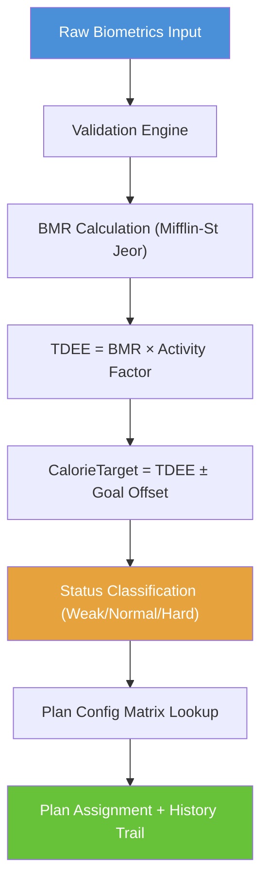
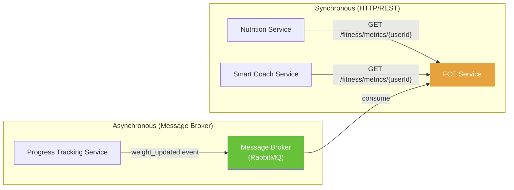

# Fitness Calculation Engine (FCE) Service — Implementation-Ready Engineering Report

> [!NOTE]
> This report is derived from the analysis of four architecture documents:
> - [Database per Service.md](file:///d:/work/Fitness/AppFlow/Database%20per%20Service.md)
> - [Elevate Fitness App user stories.md](file:///d:/work/Fitness/AppFlow/Elevate%20Fitness%20App%20user%20stories.md)
> - [Elevate Fitness App.md](file:///d:/work/Fitness/AppFlow/Elevate%20Fitness%20App.md)
> - [Elevate Fitness Flow.md](file:///d:/work/Fitness/AppFlow/Elevate%20Fitness%20Flow.md)

---

## 1. Service Overview & Core Domain

### 1.1 Primary Responsibility

The **Fitness Calculation Engine (FCE)** is the algorithmic brain of the Elevate Fitness platform. It is a **stateful computation service** that transforms raw physical biometric inputs into scientifically-derived metabolic targets and automatically maps users to optimal fitness plans.

### 1.2 Bounded Context

The FCE operates within the **Metabolic Computation & Plan Assignment** bounded context. It owns the following sub-domains:

| Sub-Domain | Description |
|---|---|
| **Biometric Ingestion** | Captures and validates user physical measurements (weight, height, age, gender, activity level, goal) |
| **Metabolic Computation** | Executes Mifflin-St Jeor equations to derive BMR, TDEE, and calorie targets |
| **Difficulty Classification** | Categorizes users into tier statuses (`Weak`, `Normal`, `Hard`) based on computed calorie targets |
| **Plan Configuration Rules** | Maintains the rulebook matrix that maps `(Goal × Status)` to a specific fitness plan |
| **Plan Assignment & Lifecycle** | Assigns users to plans, manages active plan tracking, and maintains immutable audit history |
| **Reactive Recalculation** | Listens for external weight-change events and autonomously re-derives all metabolic metrics |

### 1.3 Business Logic Owned



**Mathematical Formulas:**

| Formula | Equation |
|---|---|
| **Male BMR** | `BMR = (10 × weight_kg) + (6.25 × height_cm) − (5 × age) + 5` |
| **Female BMR** | `BMR = (10 × weight_kg) + (6.25 × height_cm) − (5 × age) − 161` |
| **TDEE** | `TDEE = BMR × ActivityFactor` |

**Activity Factor Multipliers:**

| Level | Factor |
|---|---|
| Rookie | 1.2 |
| Beginner | 1.375 |
| Intermediate | 1.55 |
| Advance | 1.725 |
| TrueBeast | 1.9 |

**Calorie Target Offsets by Goal:**

| Goal | Formula |
|---|---|
| Lose Weight | `TDEE − 500` |
| Get Fitter | `TDEE` (maintenance) |
| Gain Weight | `TDEE + 300` |
| Gain More Flexible | `TDEE + 150` |
| Learn the Basic | `TDEE` (maintenance) |

**Status Classification Tiers:**

| Calorie Target Range | Status |
|---|---|
| ≤ 1800 kcal | `Weak` |
| 1801 – 2500 kcal | `Normal` |
| > 2500 kcal | `Hard` |

---

## 2. Database Schema (Entity Framework Core)

> [!IMPORTANT]
> This service follows the **Database per Service** pattern. The FCE owns its own isolated database. Cross-service data references use `UserId` as a correlation key — there are **no foreign keys** to tables in other service databases.

### 2.1 Entity Relationship Diagram

```mermaid
erDiagram
    UserFitnessStats ||--o| CalculatedMetrics : "derives"
    CalculatedMetrics ||--o| UserAssignedPlans : "determines"
    FitnessPlanConfig ||--o{ UserAssignedPlans : "maps to"
    UserAssignedPlans ||--o{ UserPlanHistory : "archives to"
    
    UserFitnessStats {
        int Id PK
        int UserId UK
        double Weight
        double Height
        int Age
        string Gender
        string Goal
        string ActivityLevel
        DateTime RecordedAt
    }
    
    CalculatedMetrics {
        int Id PK
        int UserId UK
        double Bmr
        double Tdee
        double CalorieTarget
        string Status
        DateTime CalculatedAt
    }
    
    FitnessPlanConfig {
        string PlanId PK
        string PlanName
        string Description
        string Goal
        string Status
        double MinCalorie
        double MaxCalorie
        string EstimatedDuration
        int WorkoutsPerWeek
        string ProgramType
    }
    
    UserAssignedPlans {
        int Id PK
        int UserId IX
        string PlanId FK
        DateTime AssignedAt
        bool IsActive
    }
    
    UserPlanHistory {
        int Id PK
        int UserId IX
        string PlanId
        DateTime AssignedAt
        DateTime EndedAt
        string ReasonForChange
    }
```

---

### 2.2 Table: `UserFitnessStats`

**Purpose:** Stores raw physical input variables submitted by the user during onboarding or profile updates.

| Column Name | Data Type | Constraints | Description |
|---|---|---|---|
| `Id` | `int` | **PK**, Identity, Auto-Increment | Metrics snapshot entry ID |
| `UserId` | `int` | **Unique Index**, NOT NULL | Correlates to Auth `Users.Id` (no FK — cross-service) |
| `Weight` | `double` | NOT NULL, CHECK (40 ≤ Weight ≤ 200) | Weight in kilograms |
| `Height` | `double` | NOT NULL, CHECK (140 ≤ Height ≤ 220) | Height in centimeters |
| `Age` | `int` | NOT NULL, CHECK (16 ≤ Age ≤ 100) | User's age in years |
| `Gender` | `string` | NOT NULL, VarChar(10), CHECK IN ('Male', 'Female') | Biological indicator for formula selection |
| `Goal` | `string` | NOT NULL, VarChar(50), CHECK IN ('Lose Weight', 'Get Fitter', 'Gain Weight', 'Gain More Flexible', 'Learn the Basic') | User's fitness objective |
| `ActivityLevel` | `string` | NOT NULL, VarChar(30), CHECK IN ('Rookie', 'Beginner', 'Intermediate', 'Advance', 'TrueBeast') | Activity multiplier selector |
| `RecordedAt` | `DateTime` | NOT NULL, DEFAULT UTC_NOW | Entry timestamp |

**Relationships:** 1:1 with `CalculatedMetrics` (via `UserId`), 1:1 with `UserAssignedPlans` (via `UserId`)

**EF Core Configuration Notes:**
```csharp
// Fluent API
builder.HasIndex(e => e.UserId).IsUnique();
builder.Property(e => e.Gender).HasMaxLength(10);
builder.Property(e => e.Goal).HasMaxLength(50);
builder.Property(e => e.ActivityLevel).HasMaxLength(30);
```

---

### 2.3 Table: `CalculatedMetrics`

**Purpose:** Stores derived metabolic outputs computed from the user's `UserFitnessStats`. This is the **single source of truth** for a user's active metabolic state.

| Column Name | Data Type | Constraints | Description |
|---|---|---|---|
| `Id` | `int` | **PK**, Identity, Auto-Increment | Primary identifier |
| `UserId` | `int` | **Unique Index**, NOT NULL | One active calculation per user |
| `Bmr` | `double` | NOT NULL | Basal Metabolic Rate (e.g., `1728.75`) |
| `Tdee` | `double` | NOT NULL | Total Daily Energy Expenditure (e.g., `2679.56`) |
| `CalorieTarget` | `double` | NOT NULL | Goal-adjusted daily calorie allocation (e.g., `2179.56`) |
| `Status` | `string` | NOT NULL, VarChar(20), CHECK IN ('Weak', 'Normal', 'Hard') | Classification tier |
| `CalculatedAt` | `DateTime` | NOT NULL, DEFAULT UTC_NOW | Computation timestamp |

**Relationships:** 1:1 with `UserFitnessStats` (via `UserId`)

**Operation Pattern:** UPSERT — if a `CalculatedMetrics` row exists for this `UserId`, update it; otherwise, insert a new row.

---

### 2.4 Table: `FitnessPlanConfig`

**Purpose:** Seed/reference data — the rulebook blueprint that maps `(Goal × Status)` combinations to specific fitness plan configurations. This is a **read-only lookup table** populated via migrations/seed scripts.

| Column Name | Data Type | Constraints | Description |
|---|---|---|---|
| `PlanId` | `string` | **PK**, VarChar(50) | Structural identifier (e.g., `"plan_lw_normal"`) |
| `PlanName` | `string` | NOT NULL, VarChar(100) | Human-readable label (e.g., `"Weight Loss - Normal Intensity"`) |
| `Description` | `string` | VarChar(500) | Plan summary text |
| `Goal` | `string` | NOT NULL, VarChar(50), Indexed | Goal classifier (e.g., `"Lose Weight"`) |
| `Status` | `string` | NOT NULL, VarChar(20), Indexed | Status tier (e.g., `"Normal"`) |
| `MinCalorie` | `double` | NOT NULL | Lower calorie boundary threshold |
| `MaxCalorie` | `double` | NOT NULL | Upper calorie boundary threshold |
| `EstimatedDuration` | `string` | VarChar(50) | Expected program duration (e.g., `"8 weeks"`) |
| `WorkoutsPerWeek` | `int` | NOT NULL | Training day frequency (e.g., `4`) |
| `ProgramType` | `string` | VarChar(50) | Program category (e.g., `"Cardio + Strength"`) |

**Relationships:** 1:N with `UserAssignedPlans` (one plan config can be assigned to many users)

**Composite Index:** `(Goal, Status)` — this is the primary lookup path

> [!TIP]
> The `PlanId` (also referred to as `ExternalPlanId` in some documents) is the cross-service contract key. The Workout Service uses this same identifier in its `WorkoutPlans.ExternalPlanId` column to pair its content library with FCE assignments.

---

### 2.5 Table: `UserAssignedPlans`

**Purpose:** Tracks the user's current active fitness plan assignment. Only **one row** per user should have `IsActive = true` at any time.

| Column Name | Data Type | Constraints | Description |
|---|---|---|---|
| `Id` | `int` | **PK**, Identity, Auto-Increment | Assignment entry ID |
| `UserId` | `int` | NOT NULL, Indexed | Target user (filtered index on `IsActive = true`) |
| `PlanId` | `string` | NOT NULL, VarChar(50), **FK** → `FitnessPlanConfig.PlanId` | Assigned plan identifier |
| `AssignedAt` | `DateTime` | NOT NULL, DEFAULT UTC_NOW | Assignment timestamp |
| `IsActive` | `bool` | NOT NULL, DEFAULT `true` | Active plan flag |

**Relationships:** N:1 with `FitnessPlanConfig` (via `PlanId`), 1:N with `UserPlanHistory` (when deactivated, a history row is created)

**Business Invariant:** At most one `IsActive = true` row per `UserId`. Enforced at the application level.

---

### 2.6 Table: `UserPlanHistory`

**Purpose:** **Immutable audit log** tracking every plan reassignment event. Rows are never updated or deleted after insertion.

| Column Name | Data Type | Constraints | Description |
|---|---|---|---|
| `Id` | `int` | **PK**, Identity, Auto-Increment | History log entry ID |
| `UserId` | `int` | NOT NULL, Indexed | Target user |
| `PlanId` | `string` | NOT NULL, VarChar(50) | The plan that was previously active |
| `AssignedAt` | `DateTime` | NOT NULL | When this plan was originally assigned |
| `EndedAt` | `DateTime?` | Nullable | When this plan was deactivated (null if still active) |
| `ReasonForChange` | `string` | NOT NULL, VarChar(255) | Context for the change (e.g., `"weight_update"`, `"initial_assignment"`, `"goal_change"`) |

**Relationships:** References `UserId` from `UserAssignedPlans` contextually (no FK — append-only pattern)

> [!CAUTION]
> This table is **append-only**. Never issue UPDATE or DELETE commands against it. This is critical for audit compliance and data integrity.

---

## 3. API Endpoints (Vertical Slice Architecture & CQRS)

> [!NOTE]
> All endpoints return the **unified response envelope**:
> ```json
> {
>   "isSuccess": true|false,
>   "message": "string",
>   "data": { },
>   "errors": [],
>   "statusCode": 200,
>   "timestamp": "2026-06-17T17:30:00Z"
> }
> ```
> All endpoints require `Authorization: Bearer {token}` unless stated otherwise.

---

### 3.1 `POST /api/v1/fitness/weight-goal-activity`

| Attribute | Value |
|---|---|
| **Purpose** | Ingest raw biometric data during onboarding (Sprint 5, User Story: FCE Ingestion) |
| **CQRS Type** | **Command** → `SaveFitnessStatsCommand` handled by `SaveFitnessStatsCommandHandler` |
| **Auth** | Authenticated |

**Request Payload:**
```json
{
  "userId": "usr_123456",
  "weight": 75.5,
  "height": 175,
  "age": 25,
  "gender": "Male",
  "goal": "Lose Weight",
  "activityLevel": "Intermediate"
}
```

**Validation Rules:**
| Field | Rule |
|---|---|
| `age` | 16 ≤ value ≤ 100 |
| `weight` | 40.0 ≤ value ≤ 200.0 (kg) |
| `height` | 140.0 ≤ value ≤ 220.0 (cm) |
| `gender` | Must be `"Male"` or `"Female"` |
| `goal` | Must be one of: `"Lose Weight"`, `"Get Fitter"`, `"Gain Weight"`, `"Gain More Flexible"`, `"Learn the Basic"` |
| `activityLevel` | Must be one of: `"Rookie"`, `"Beginner"`, `"Intermediate"`, `"Advance"`, `"TrueBeast"` |

**Success Response (200 OK):**
```json
{
  "isSuccess": true,
  "message": "Fitness stats saved successfully.",
  "data": {
    "userId": "usr_123456",
    "weight": 75.5,
    "height": 175,
    "age": 25,
    "gender": "Male",
    "goal": "Lose Weight",
    "activityLevel": "Intermediate",
    "recordedAt": "2026-06-17T17:28:00Z"
  },
  "errors": [],
  "statusCode": 200,
  "timestamp": "2026-06-17T17:28:00Z"
}
```

**Error Responses:**
| Code | HTTP Status | Condition |
|---|---|---|
| `VAL_INVALID_WEIGHT` | 400 | Weight outside 40–200 kg |
| `VAL_INVALID_HEIGHT` | 400 | Height outside 140–220 cm |
| `VAL_INVALID_AGE` | 400 | Age outside 16–100 |
| `VAL_INVALID_GENDER` | 400 | Gender not Male/Female |
| `VAL_REQUIRED_FIELD` | 400 | Missing required fields |

**Database Impact:** `INSERT` into `UserFitnessStats` (or `UPSERT` if row exists for this `UserId`)

---

### 3.2 `POST /api/v1/fitness/calculate`

| Attribute | Value |
|---|---|
| **Purpose** | Execute metabolic computation pipeline: BMR → TDEE → CalorieTarget → Status (Sprint 5) |
| **CQRS Type** | **Command** → `CalculateMetricsCommand` handled by `CalculateMetricsCommandHandler` |
| **Auth** | Authenticated |

**Request Payload:**
```json
{
  "userId": "usr_123456"
}
```

**Success Response (200 OK):**
```json
{
  "isSuccess": true,
  "message": "Fitness metrics calculated successfully.",
  "data": {
    "bmr": 1728.75,
    "tdee": 2679.56,
    "calorieTarget": 2179.56,
    "status": "Normal"
  },
  "errors": [],
  "statusCode": 200,
  "timestamp": "2026-06-17T17:30:00Z"
}
```

**Business Logic Flow:**
1. Fetch latest `UserFitnessStats` for the given `UserId`
2. Apply BMR formula based on `Gender`
3. Multiply BMR by `ActivityLevel` factor → `TDEE`
4. Apply `Goal` offset → `CalorieTarget`
5. Classify into `Status` tier
6. `UPSERT` into `CalculatedMetrics`

**Error Responses:**
| Code | HTTP Status | Condition |
|---|---|---|
| `FCE_STATS_NOT_FOUND` | 404 | No `UserFitnessStats` row exists for this user |

---

### 3.3 `POST /api/v1/fitness/assign-plan`

| Attribute | Value |
|---|---|
| **Purpose** | Automatically assign the optimal fitness plan based on calculated metrics (Sprint 6) |
| **CQRS Type** | **Command** → `AssignPlanCommand` handled by `AssignPlanCommandHandler` |
| **Auth** | Authenticated |

**Request Payload:**
```json
{
  "userId": "usr_123456"
}
```

**Success Response (200 OK):**
```json
{
  "isSuccess": true,
  "message": "Fitness plan assigned successfully.",
  "data": {
    "planId": "plan_lw_normal",
    "planName": "Weight Loss - Normal Intensity",
    "goal": "Lose Weight",
    "status": "Normal",
    "workoutsPerWeek": 4,
    "isReassignment": false
  },
  "errors": [],
  "statusCode": 200,
  "timestamp": "2026-06-17T17:32:00Z"
}
```

**Business Logic Flow:**
1. Fetch `CalculatedMetrics` for the `UserId`
2. Query `FitnessPlanConfig WHERE Goal = @Goal AND Status = @Status`
3. Check for existing active row in `UserAssignedPlans WHERE UserId = @UserId AND IsActive = true`
4. **If existing active plan found:**
   - `UPDATE UserAssignedPlans SET IsActive = false`
   - `INSERT INTO UserPlanHistory` (archive the old assignment)
5. `INSERT INTO UserAssignedPlans` with `IsActive = true`

**Error Responses:**
| Code | HTTP Status | Condition |
|---|---|---|
| `FCE_METRICS_NOT_CALCULATED` | 400 | No `CalculatedMetrics` exists — user must call `/calculate` first |
| `FCE_NO_MATCHING_PLAN` | 404 | No `FitnessPlanConfig` matches the `(Goal, Status)` combination |

---

### 3.4 `PUT /api/v1/fitness/recalculate/{userId}`

| Attribute | Value |
|---|---|
| **Purpose** | Re-derive all metabolic metrics using updated biometrics (Sprint 6, triggered by weight changes) |
| **CQRS Type** | **Command** → `RecalculateMetricsCommand` handled by `RecalculateMetricsCommandHandler` |
| **Auth** | Authenticated / Internal (may also be triggered by event consumer) |

**Request Payload (Optional):**
```json
{
  "reason": "weight_update",
  "newWeight": 73.0,
  "triggeredBy": "progress_service"
}
```

**Success Response (200 OK):**
```json
{
  "isSuccess": true,
  "message": "Metrics recalculated and plan history logged.",
  "data": {
    "previousMetrics": {
      "bmr": 1728.75,
      "tdee": 2679.56,
      "calorieTarget": 2179.56,
      "status": "Normal"
    },
    "newMetrics": {
      "bmr": 1703.75,
      "tdee": 2640.81,
      "calorieTarget": 2140.81,
      "status": "Normal"
    },
    "planReassignment": false,
    "previousStatus": "Normal",
    "newStatus": "Normal"
  },
  "errors": [],
  "statusCode": 200,
  "timestamp": "2026-06-17T17:35:00Z"
}
```

**Business Logic Flow:**
1. If `newWeight` is provided, update `UserFitnessStats.Weight` for the user
2. Re-execute the full metabolic pipeline (BMR → TDEE → CalorieTarget → Status)
3. Compare `previousStatus` vs `newStatus`
4. **If status tier shifts** (e.g., `Normal` → `Hard`):
   - Execute the full plan reassignment sequence (deactivate old, archive to history, assign new)
5. Update `CalculatedMetrics` with new values

**Error Responses:**
| Code | HTTP Status | Condition |
|---|---|---|
| `FCE_STATS_NOT_FOUND` | 404 | No `UserFitnessStats` row for this user |
| `FCE_NO_MATCHING_PLAN` | 404 | Plan reassignment needed but no matching config found |

---

### 3.5 `GET /api/v1/fitness/metrics/{userId}`

| Attribute | Value |
|---|---|
| **Purpose** | Retrieve the user's current calculated metabolic metrics (Sprint 5) |
| **CQRS Type** | **Query** → `GetUserMetricsQuery` handled by `GetUserMetricsQueryHandler` |
| **Auth** | Authenticated |

**Success Response (200 OK):**
```json
{
  "isSuccess": true,
  "message": "Metrics retrieved successfully.",
  "data": {
    "userId": "usr_123456",
    "bmr": 1728.75,
    "tdee": 2679.56,
    "calorieTarget": 2179.56,
    "status": "Normal",
    "calculatedAt": "2026-06-17T17:30:00Z"
  },
  "errors": [],
  "statusCode": 200,
  "timestamp": "2026-06-17T17:33:00Z"
}
```

**Error Responses:**
| Code | HTTP Status | Condition |
|---|---|---|
| `FCE_STATS_NOT_FOUND` | 404 | No calculated metrics exist for this user |

> [!IMPORTANT]
> This is the endpoint the **Nutrition Service** and **Smart Coach Service** call synchronously via internal HTTP to retrieve a user's calorie target for personalized recommendations.

---

### 3.6 `GET /api/v1/fitness/stats/{userId}`

| Attribute | Value |
|---|---|
| **Purpose** | Retrieve raw fitness input stats for a user (Sprint 5) |
| **CQRS Type** | **Query** → `GetUserFitnessStatsQuery` handled by `GetUserFitnessStatsQueryHandler` |
| **Auth** | Authenticated |

**Success Response (200 OK):**
```json
{
  "isSuccess": true,
  "message": "Fitness stats retrieved successfully.",
  "data": {
    "userId": "usr_123456",
    "weight": 75.5,
    "height": 175,
    "age": 25,
    "gender": "Male",
    "goal": "Lose Weight",
    "activityLevel": "Intermediate",
    "recordedAt": "2026-06-17T17:28:00Z"
  },
  "errors": [],
  "statusCode": 200,
  "timestamp": "2026-06-17T17:34:00Z"
}
```

---

### 3.7 `GET /api/v1/fitness/plan-configs`

| Attribute | Value |
|---|---|
| **Purpose** | Retrieve all available fitness plan configuration rules (Sprint 6) |
| **CQRS Type** | **Query** → `GetPlanConfigsQuery` handled by `GetPlanConfigsQueryHandler` |
| **Auth** | Authenticated |

**Success Response (200 OK):**
```json
{
  "isSuccess": true,
  "message": "Plan configurations retrieved.",
  "data": [
    {
      "planId": "plan_lw_weak",
      "planName": "Weight Loss - Low Intensity",
      "goal": "Lose Weight",
      "status": "Weak",
      "minCalorie": 0,
      "maxCalorie": 1800,
      "workoutsPerWeek": 3,
      "programType": "Light Cardio"
    },
    {
      "planId": "plan_lw_normal",
      "planName": "Weight Loss - Normal Intensity",
      "goal": "Lose Weight",
      "status": "Normal",
      "minCalorie": 1801,
      "maxCalorie": 2500,
      "workoutsPerWeek": 4,
      "programType": "Cardio + Strength"
    }
  ],
  "errors": [],
  "statusCode": 200,
  "timestamp": "2026-06-17T17:36:00Z"
}
```

---

### 3.8 `GET /api/v1/fitness/plans/{planId}`

| Attribute | Value |
|---|---|
| **Purpose** | Retrieve a specific plan configuration by its ID (Sprint 6) |
| **CQRS Type** | **Query** → `GetPlanByIdQuery` handled by `GetPlanByIdQueryHandler` |
| **Auth** | Authenticated |

**Success Response (200 OK):**
```json
{
  "isSuccess": true,
  "message": "Plan configuration resolved.",
  "data": {
    "planId": "plan_lw_normal",
    "planName": "Weight Loss - Normal Intensity",
    "description": "Balanced workout plan combining cardio and strength training for effective weight loss.",
    "goal": "Lose Weight",
    "status": "Normal",
    "minCalorie": 1801,
    "maxCalorie": 2500,
    "estimatedDuration": "8 weeks",
    "workoutsPerWeek": 4,
    "programType": "Cardio + Strength"
  },
  "errors": [],
  "statusCode": 200,
  "timestamp": "2026-06-17T17:37:00Z"
}
```

**Error Responses:**
| Code | HTTP Status | Condition |
|---|---|---|
| `FCE_NO_MATCHING_PLAN` | 404 | No plan found with the given `planId` |

---

### Summary: Endpoint-to-MediatR Mapping

| # | HTTP Method & Route | CQRS Type | MediatR Handler | Sprint |
|---|---|---|---|---|
| 1 | `POST /api/v1/fitness/weight-goal-activity` | Command | `SaveFitnessStatsCommandHandler` | 5 |
| 2 | `POST /api/v1/fitness/calculate` | Command | `CalculateMetricsCommandHandler` | 5 |
| 3 | `POST /api/v1/fitness/assign-plan` | Command | `AssignPlanCommandHandler` | 6 |
| 4 | `PUT /api/v1/fitness/recalculate/{userId}` | Command | `RecalculateMetricsCommandHandler` | 6 |
| 5 | `GET /api/v1/fitness/metrics/{userId}` | Query | `GetUserMetricsQueryHandler` | 5 |
| 6 | `GET /api/v1/fitness/stats/{userId}` | Query | `GetUserFitnessStatsQueryHandler` | 5 |
| 7 | `GET /api/v1/fitness/plan-configs` | Query | `GetPlanConfigsQueryHandler` | 6 |
| 8 | `GET /api/v1/fitness/plans/{planId}` | Query | `GetPlanByIdQueryHandler` | 6 |

---

## 4. Inter-Service Communication

### 4.1 Communication Architecture Diagram



---

### 4.2 Synchronous Communication (FCE as Provider)

The FCE **exposes** endpoints consumed synchronously by other services. The FCE itself does **not** make any outbound synchronous HTTP calls to other services.

| Consumer Service | Endpoint Called | Purpose | Data Returned |
|---|---|---|---|
| **Nutrition Service** | `GET /api/v1/fitness/metrics/{userId}` | Fetches the user's active `CalorieTarget` and `Status` to filter meal recommendations within the user's caloric range | `{ bmr, tdee, calorieTarget, status }` |
| **Smart Coach Service** | `GET /api/v1/fitness/metrics/{userId}` | Reads active biological goals and calorie targets to inject into AI prompt system context for personalized coaching | `{ bmr, tdee, calorieTarget, status }` |
| **Smart Coach Service** (`/home` aggregation) | `GET /api/v1/fitness/metrics/{userId}` | Pulls FCE data as part of the dashboard feed aggregation cache refresh | `{ bmr, tdee, calorieTarget, status }` |

> [!TIP]
> Consider implementing an **internal API client** (typed `HttpClient` via `IHttpClientFactory`) for service-to-service calls. This allows downstream consumers to call FCE endpoints using a strongly-typed SDK rather than raw HTTP, and enables retry policies with Polly.

---

### 4.3 Asynchronous Communication (Event-Driven)

#### 4.3.1 Events Consumed by FCE

| Event Name | Publisher | Broker Details | Payload | FCE Reaction |
|---|---|---|---|---|
| `weight_updated` | Progress Tracking Service | Exchange: `weight_events`, Routing Key: `weight.updated` | `{ "UserId": int, "NewWeight": double, "RecordedAt": "DateTime" }` | 1. Fetch user's `UserFitnessStats`<br/>2. Update weight value<br/>3. Re-derive BMR, TDEE, CalorieTarget<br/>4. Re-classify Status tier<br/>5. If status changes → execute plan reassignment sequence<br/>6. Update `CalculatedMetrics` |

#### 4.3.2 Events Published by FCE

Based on the current architecture documents, the FCE does **not** publish any integration events. It is purely a consumer on the async side. However, the following event publication could be considered for future extensibility:

| Potential Event | Trigger | Subscribers | Payload |
|---|---|---|---|
| `metrics_recalculated` *(optional, not in docs)* | After successful recalculation via `weight_updated` | Smart Coach (cache invalidation), Notification Service | `{ "UserId", "NewCalorieTarget", "NewStatus", "PlanReassigned": bool }` |

> [!WARNING]
> The `weight_updated` consumer is a **background worker** (e.g., `IHostedService` / `BackgroundService` with a RabbitMQ consumer). It must be **idempotent** — processing the same event twice should produce the same result. Use `RecordedAt` timestamps or a deduplication check to guard against duplicate processing.

---

### 4.4 Full Communication Matrix

```
┌─────────────────────────────────────────────────────────────────────────┐
│                     FCE SERVICE COMMUNICATION MAP                      │
├─────────────────────────────────────────────────────────────────────────┤
│                                                                         │
│  INBOUND SYNC (FCE as Provider):                                        │
│  ───────────────────────────────                                        │
│  Nutrition Service ──── HTTP GET ────► FCE /metrics/{userId}            │
│  Smart Coach       ──── HTTP GET ────► FCE /metrics/{userId}            │
│                                                                         │
│  INBOUND ASYNC (FCE as Consumer):                                       │
│  ────────────────────────────────                                       │
│  Progress Service  ──── Event ──────► FCE [weight_updated]              │
│      via RabbitMQ                     │                                 │
│                                       ├── Recalculate Metrics           │
│                                       └── Conditional Plan Reassignment │
│                                                                         │
│  OUTBOUND SYNC:  NONE                                                   │
│  OUTBOUND ASYNC: NONE (currently)                                       │
│                                                                         │
└─────────────────────────────────────────────────────────────────────────┘
```

---

## 5. Developer Onboarding & Strategy

### 5.1 Step-by-Step Build Guide

#### Phase 1: Project Scaffolding & Infrastructure (Day 1)

```
1. Create the solution structure using Vertical Slice Architecture:
   
   FitnessCalculationEngine/
   ├── src/
   │   ├── FCE.API/                          # ASP.NET Core Web API host
   │   │   ├── Controllers/
   │   │   │   └── FitnessController.cs      # Thin controller, delegates to MediatR
   │   │   ├── Middleware/
   │   │   │   └── GlobalExceptionMiddleware.cs
   │   │   └── Program.cs
   │   ├── FCE.Application/                  # CQRS Commands/Queries + Handlers
   │   │   ├── Common/
   │   │   │   ├── Behaviors/
   │   │   │   │   └── ValidationBehavior.cs  # MediatR pipeline behavior
   │   │   │   └── Models/
   │   │   │       └── ApiResponse.cs         # Unified envelope
   │   │   ├── FitnessStats/
   │   │   │   ├── Commands/
   │   │   │   │   └── SaveFitnessStats/
   │   │   │   │       ├── SaveFitnessStatsCommand.cs
   │   │   │   │       ├── SaveFitnessStatsCommandHandler.cs
   │   │   │   │       └── SaveFitnessStatsValidator.cs
   │   │   │   └── Queries/
   │   │   │       └── GetUserFitnessStats/
   │   │   ├── Calculations/
   │   │   │   ├── Commands/
   │   │   │   │   ├── CalculateMetrics/
   │   │   │   │   └── RecalculateMetrics/
   │   │   │   └── Queries/
   │   │   │       └── GetUserMetrics/
   │   │   └── Plans/
   │   │       ├── Commands/
   │   │       │   └── AssignPlan/
   │   │       └── Queries/
   │   │           ├── GetPlanConfigs/
   │   │           └── GetPlanById/
   │   ├── FCE.Domain/                       # Entities, Value Objects, Enums
   │   │   ├── Entities/
   │   │   ├── Enums/
   │   │   │   ├── Gender.cs
   │   │   │   ├── FitnessGoal.cs
   │   │   │   ├── ActivityLevel.cs
   │   │   │   └── CalorieStatus.cs
   │   │   └── Services/
   │   │       └── MetabolicCalculator.cs    # Pure domain logic
   │   ├── FCE.Infrastructure/               # EF Core, Message Broker
   │   │   ├── Persistence/
   │   │   │   ├── FceDbContext.cs
   │   │   │   ├── Configurations/           # Fluent API configs
   │   │   │   └── Migrations/
   │   │   └── Messaging/
   │   │       └── WeightUpdatedConsumer.cs
   │   └── FCE.Contracts/                    # Shared DTOs, Integration Events
   │       └── Events/
   │           └── WeightUpdatedEvent.cs
   └── tests/
       ├── FCE.UnitTests/
       └── FCE.IntegrationTests/
```

#### Phase 2: Domain Layer (Day 1–2)

```
2. Build the pure domain logic FIRST:
   a. Define enums: Gender, FitnessGoal, ActivityLevel, CalorieStatus
   b. Build MetabolicCalculator as a stateless, pure service:
      - CalculateBmr(weight, height, age, gender) → double
      - CalculateTdee(bmr, activityLevel) → double  
      - CalculateCalorieTarget(tdee, goal) → double
      - ClassifyStatus(calorieTarget) → CalorieStatus
   c. Write comprehensive unit tests for MetabolicCalculator
      (this is the most critical piece — test every formula edge case)
```

#### Phase 3: Persistence Layer (Day 2–3)

```
3. Set up Entity Framework Core:
   a. Define entity classes for all 5 tables
   b. Create Fluent API configurations with proper constraints
   c. Add EF Core migrations
   d. Seed FitnessPlanConfig with the complete rulebook matrix
   e. Write integration tests against an in-memory or test DB
```

#### Phase 4: Application Layer — Commands (Day 3–4)

```
4. Implement CQRS command handlers via MediatR:
   a. SaveFitnessStatsCommand + FluentValidation validator
   b. CalculateMetricsCommand (calls MetabolicCalculator)
   c. AssignPlanCommand (plan matching + history logging)
   d. RecalculateMetricsCommand (full pipeline re-execution)
   e. Add ValidationBehavior<TRequest, TResponse> to MediatR pipeline
```

#### Phase 5: Application Layer — Queries (Day 4)

```
5. Implement query handlers:
   a. GetUserMetricsQuery
   b. GetUserFitnessStatsQuery
   c. GetPlanConfigsQuery
   d. GetPlanByIdQuery
```

#### Phase 6: API Layer (Day 4–5)

```
6. Wire up the API:
   a. Create thin FitnessController (all routes delegate to MediatR)
   b. Implement GlobalExceptionMiddleware for error envelope formatting
   c. Add Swagger/OpenAPI documentation
   d. Configure CORS, authentication middleware
```

#### Phase 7: Async Consumer (Day 5)

```
7. Build the weight_updated event consumer:
   a. Implement RabbitMQ consumer as BackgroundService
   b. Deserialize WeightUpdatedEvent
   c. Call RecalculateMetricsCommand internally
   d. Add idempotency guards
   e. Add dead-letter queue handling for failed messages
```

#### Phase 8: Testing & Hardening (Day 6)

```
8. Final verification:
   a. Run all unit tests (especially formula edge cases)
   b. Run integration tests with real DB
   c. Test the async consumer with simulated events
   d. Performance test the recalculation pipeline
   e. Verify all error codes map correctly
```

---

### 5.2 Edge Cases & Calculation Complexities

> [!WARNING]
> Pay close attention to these scenarios — they represent the highest risk areas.

#### Floating-Point Precision
- BMR/TDEE calculations use `double` arithmetic. Small rounding errors can cause a user to oscillate between `Normal` and `Hard` status at the 2500 kcal boundary.
- **Mitigation:** Round `CalorieTarget` to 2 decimal places before status classification. Consider adding a ±5 kcal dead zone at tier boundaries to prevent flip-flopping.

#### Status Tier Boundary Oscillation
- A user with a CalorieTarget near 1800 or 2500 could trigger repeated plan reassignments with minor weight changes (e.g., daily natural fluctuations of ±0.5 kg).
- **Mitigation:** Implement a **hysteresis buffer** — only trigger reassignment if the status shift is sustained, or require a minimum weight delta (e.g., ≥ 1.0 kg change) before triggering recalculation.

#### Concurrent Recalculation Race Conditions
- If a user updates their weight multiple times in quick succession, multiple `weight_updated` events will be published. The FCE consumer could process them concurrently, causing data corruption.
- **Mitigation:** Use **optimistic concurrency tokens** on `CalculatedMetrics` (EF Core `ConcurrencyCheck` / `RowVersion`). Process events sequentially per `UserId` using a partitioned consumer or distributed lock.

#### Plan Config Gaps
- If the `FitnessPlanConfig` seed data has gaps (e.g., no entry for `Goal = "Gain More Flexible"` AND `Status = "Weak"`), the plan assignment will fail silently or throw.
- **Mitigation:** Validate the complete `Goal × Status` matrix during application startup. Log warnings for any missing combinations. Return `FCE_NO_MATCHING_PLAN` with diagnostic details.

#### Event Consumer Idempotency
- The `weight_updated` event consumer must be idempotent. If the same message is delivered twice (network retry, broker redelivery), reprocessing must not corrupt history logs.
- **Mitigation:** Check `CalculatedMetrics.CalculatedAt` against the event's `RecordedAt`. If the event is older than the last calculation, skip it. Add a `ProcessedEvents` deduplication table or use message IDs.

#### User Without Stats Requesting Calculation
- A user who hasn't submitted biometric data yet calls `/calculate` or `/assign-plan`.
- **Mitigation:** Return `FCE_STATS_NOT_FOUND` (404) or `FCE_METRICS_NOT_CALCULATED` (400) with clear messaging to direct the user through the correct onboarding flow.

---

### 5.3 Performance Considerations

| Concern | Recommendation |
|---|---|
| **Hot Path: `/metrics/{userId}`** | This endpoint is called by both Nutrition and Smart Coach services for every personalized request. Add **response caching** (in-memory or distributed) with a short TTL (e.g., 5 minutes). Invalidate on recalculation. |
| **FitnessPlanConfig Lookups** | This is a small, static dataset. Load it into an **in-memory cache** at startup and refresh only on configuration changes. |
| **UserPlanHistory Growth** | This is an append-only table that will grow indefinitely. Add a **composite index** on `(UserId, AssignedAt DESC)` for efficient history queries. Consider archival strategies for users with hundreds of entries. |
| **Event Consumer Throughput** | The `weight_updated` consumer should process events per-user sequentially but can parallelize across different users. Use RabbitMQ **consistent hashing exchange** or partition by `UserId`. |
| **Database Connection Pooling** | Configure EF Core's connection pool size based on expected load. The FCE is a computation-heavy service with relatively low query volume but high write precision requirements. |

---

### 5.4 Recommended NuGet Packages

| Package | Purpose |
|---|---|
| `MediatR` | CQRS command/query dispatching |
| `FluentValidation` | Request payload validation |
| `MediatR.Extensions.FluentValidation.AspNetCore` | Auto-wiring validators into MediatR pipeline |
| `Microsoft.EntityFrameworkCore.SqlServer` | EF Core provider for SQL Server |
| `Mapster` or `AutoMapper` | Entity ↔ DTO mapping |
| `RabbitMQ.Client` or `MassTransit` | Message broker consumer |
| `Polly` | Resilience policies (retries, circuit breakers) |
| `Serilog` | Structured logging |
| `Swashbuckle.AspNetCore` | Swagger/OpenAPI documentation |

---

### 5.5 Key Architectural Decisions Summary

| Decision | Rationale |
|---|---|
| **No outbound HTTP calls** | FCE is a pure provider. It never calls other services synchronously. This keeps it highly decoupled and independently deployable. |
| **UPSERT pattern on CalculatedMetrics** | Only one active calculation row per user. Simplifies reads and avoids orphaned historical calculation rows (history is tracked separately in `UserPlanHistory`). |
| **PlanId as string, not int** | Cross-service contract key. Using a semantic string (e.g., `"plan_lw_normal"`) makes debugging and log tracing far easier than opaque integer IDs. |
| **Immutable UserPlanHistory** | Append-only audit log. No updates or deletes. Essential for compliance, debugging plan assignment issues, and understanding user journey evolution. |
| **Background worker for weight events** | Decouples the Progress Service from the FCE's computation latency. The user gets an instant response on weight logging while recalculation happens asynchronously. |
