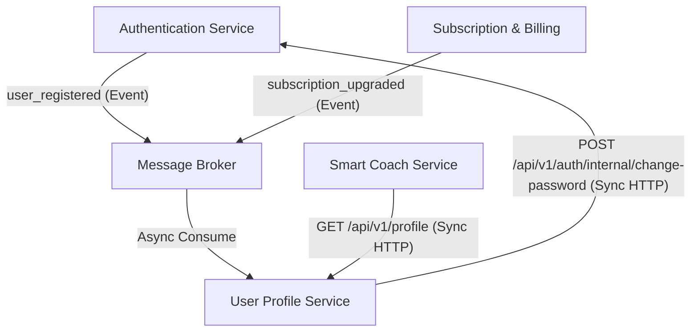

# User Profile Service — Architecture & Vertical Slice Plan

The **User Profile Service** manages user personal metadata, UI preferences, regional localization, privacy settings, and cached subscription flags. This service is structured using **Vertical Slice Architecture (VSA)** to maintain high feature cohesion and isolation.

---

## 1. Domain Boundary & Responsibilities

- **Personal Metadata Store:** Captures first name, last name, phone number, and avatar image.
- **Preference Configurations:** Houses unit settings (metric vs. imperial), themes (light/dark), and localization languages.
- **Notification & Privacy Switches:** Stores user preferences for reminders and privacy toggles.
- **Cache Synchronization:** Holds a read-only cached flag `IsPremiumCached` updated via async event subscribers.
- **Authentication Proxy (Password Change):** Hosts the password change endpoint and proxies credential updates to the Auth Service.

---

## 2. Directory Structure

Rather than dividing the codebase into horizontal layers (Controllers, Services, Repositories), the codebase is organized by business feature (slice).

```
UserProfileService/
│
├── Common/                      # Shared infrastructure across slices
│   ├── Behaviors/               # MediatR pipelines (Logging, Validation, Transaction)
│   ├── Database/                # DbContext, Migrations, Seed Data
│   │   ├── Configurations/      # Entity configuration files (UserProfileConfig, etc.)
│   │   └── ApplicationDbContext.cs
│   ├── Exceptions/              # Custom domain/system exception models
│   └── Extensions/              # General helper extensions
│
├── Features/                    # Domain-specific vertical slices
│   │
│   ├── Profiles/                # Features managing personal profiles
│   │   │
│   │   ├── GetProfile/          # Slice 1: GET /api/v1/profile
│   │   │   ├── GetProfileEndpoint.cs   # Route mapping & Minimal API declaration
│   │   │   ├── GetProfileQuery.cs      # MediatR request object
│   │   │   ├── GetProfileHandler.cs    # Feature business logic (DB query)
│   │   │   └── GetProfileResponse.cs   # Output data DTO
│   │   │
│   │   ├── UpdateProfile/       # Slice 2: PUT /api/v1/profile
│   │   │   ├── UpdateProfileEndpoint.cs
│   │   │   ├── UpdateProfileCommand.cs
│   │   │   ├── UpdateProfileValidator.cs # FluentValidation rules
│   │   │   └── UpdateProfileHandler.cs
│   │   │
│   │   ├── UploadProfilePicture/# Slice 3: POST /api/v1/profile/picture
│   │   │   ├── UploadProfilePictureEndpoint.cs
│   │   │   ├── UploadProfilePictureCommand.cs
│   │   │   └── UploadProfilePictureHandler.cs
│   │   │
│   │   └── ChangePassword/      # Slice 4: PUT /api/v1/profile/change-password
│   │       ├── ChangePasswordEndpoint.cs
│   │       ├── ChangePasswordCommand.cs
│   │       ├── ChangePasswordValidator.cs
│   │       └── ChangePasswordHandler.cs  # Proxy client forwarding to Auth Service
│   │
│   └── Settings/                # Features managing UI/User preferences
│       │
│       ├── GetSettings/         # Slice 5: GET /api/v1/settings
│       │   ├── GetSettingsEndpoint.cs
│       │   ├── GetSettingsQuery.cs
│       │   └── GetSettingsHandler.cs
│       │
│       └── UpdateSettings/      # Slice 6: PUT /api/v1/settings
│           ├── UpdateSettingsEndpoint.cs
│           ├── UpdateSettingsCommand.cs
│           ├── UpdateSettingsValidator.cs
│           └── UpdateSettingsHandler.cs
│
├── Messaging/                   # Asynchronous event handlers (consumers)
│   ├── UserRegisteredConsumer.cs
│   └── SubscriptionUpgradedConsumer.cs
│
├── Models/                      # Core EF Core domain entity models (shared across slices)
│   ├── UserProfile.cs
│   └── UserSettings.cs
│
├── Program.cs                   # App startup, routing, and DI composition root
└── appsettings.json
```

---

## 3. Database Schema

Managed via Code-First migrations in `Common/Database` and configured using the separate configuration files under `Common/Database/Configurations`.

### Table: `UserProfiles`
- `Id` (int, PK, No Identity): Matches the user ID created by the Authentication Service.
- `FirstName` (string, VarChar(50), Required)
- `LastName` (string, VarChar(50), Required)
- `Email` (string, VarChar(255), Required)
- `PhoneNumber` (string, VarChar(20), Required)
- `ProfilePictureUrl` (string, VarChar(500), Nullable)
- `IsPremiumCached` (bool, Required, default false)
- `MemberSince` (DateTime, Required)

### Table: `UserSettings`
- `Id` (int, PK, FK -> UserProfiles.Id)
- `Language` (string, VarChar(10), default 'en')
- `Theme` (string, VarChar(15), default 'light')
- `NotificationSettings` (string/JSON, Required, default `{}`)
- `PrivacySettings` (string/JSON, Required, default `{}`)
- `UnitSettings` (string/JSON, Required, default `{}`)

---

## 4. Inter-Service Communication Layout



### A. Asynchronous Event Consumers (RabbitMQ / MassTransit)
1. **`user_registered` Event:**
   - **Sender:** Authentication Service (triggered on successful user signup).
   - **Why:** To maintain autonomous service data boundaries. User Profile Service consumes this event to insert initial default records into `UserProfiles` and `UserSettings`.
   - **Payload Contract:**
     ```json
     {
       "userId": 1,
       "email": "ahmed@example.com",
       "firstName": "Ahmed",
       "lastName": "Mohamed",
       "phoneNumber": "+201234567890"
     }
     ```

2. **`subscription_upgraded` Event:**
   - **Sender:** Subscription & Billing Service (triggered on successful payment/tier upgrade).
   - **Why:** User Profile Service maintains a local read-only cache of the premium flag (`IsPremiumCached`) to prevent expensive cross-service queries during routine requests.
   - **Payload Contract:**
     ```json
     {
       "userId": 1,
       "tier": "Premium",
       "expiresAt": "2026-07-26T00:00:00Z"
     }
     ```

### B. Synchronous REST Calls (HTTP/gRPC)
1. **Profile Data Feed Aggregation (Inbound):**
   - **Client:** Smart Coach Service (and Gateway Orchestrator).
   - **Why:** When fetching dashboard layouts or generating AI coach prompt contexts, downstream services require profile names and preference units synchronously to personalize recommendations.
2. **Password Change Enforcement (Outbound):**
   - **Destination:** Authentication Service (`POST /api/v1/auth/internal/change-password`).
   - **Why:** The User Profile Service hosts the endpoint `PUT /api/v1/profile/change-password` as part of the user settings interface, but the Auth Service retains sole ownership of password hashes. Profile Service must call Auth Service internally to validate the current password and apply the new hash.

---

## 5. API Endpoints Contract

### GET `/api/v1/profile`
- **Auth Required:** Yes (extracts `X-User-Id` from token claims).
- **Response (200 OK):**
  ```json
  {
    "isSuccess": true,
    "message": "Profile retrieved successfully.",
    "data": {
      "id": 1,
      "firstName": "Ahmed",
      "lastName": "Mohamed",
      "email": "ahmed@example.com",
      "phoneNumber": "+201234567890",
      "profilePictureUrl": "/images/profiles/1.jpg",
      "isPremium": false,
      "memberSince": "2026-06-26T00:40:00Z"
    },
    "errors": [],
    "statusCode": 200,
    "timestamp": "2026-06-26T00:50:00Z"
  }
  ```

### PUT `/api/v1/profile`
- **Auth Required:** Yes.
- **Request Payload:**
  ```json
  {
    "firstName": "Ahmed",
    "lastName": "Ali",
    "email": "ahmed.ali@example.com",
    "phoneNumber": "+201234567890"
  }
  ```
- **Response (200 OK):** Standard success envelope.

### POST `/api/v1/profile/picture`
- **Auth Required:** Yes.
- **Request Payload:** Multi-part Form Data (`profilePicture` file).
- **Validation Rules:** Restrict formats to JPG/PNG. Maximum size 5MB.
- **Response (200 OK):** Returns the new relative file path string.

### PUT `/api/v1/profile/change-password`
- **Auth Required:** Yes.
- **Request Payload:**
  ```json
  {
    "currentPassword": "OldPassword123",
    "newPassword": "NewSecurePassword456",
    "confirmPassword": "NewSecurePassword456"
  }
  ```
- **Response (200 OK):** Standard success envelope.

### GET `/api/v1/settings`
- **Auth Required:** Yes.
- **Response (200 OK):**
  ```json
  {
    "isSuccess": true,
    "message": "Settings retrieved successfully.",
    "data": {
      "language": "en",
      "theme": "dark",
      "notifications": {
        "workoutReminders": true,
        "mealReminders": true,
        "achievementAlerts": true,
        "weeklyReports": true,
        "emailNotifications": true,
        "pushNotifications": true
      },
      "privacy": {
        "profileVisibility": "private",
        "showProgressToFriends": false,
        "allowDataSharing": false
      },
      "units": {
        "weight": "kg",
        "height": "cm",
        "distance": "km"
      }
    },
    "errors": [],
    "statusCode": 200,
    "timestamp": "2026-06-26T00:52:00Z"
  }
  ```

### PUT `/api/v1/settings`
- **Auth Required:** Yes.
- **Request Payload:** Supports partial JSON patches.
  ```json
  {
    "theme": "dark",
    "notifications": {
      "workoutReminders": false
    }
  }
  ```
- **Response (200 OK):** Standard success envelope.

---

## 6. Phase-by-Phase VSA Implementation Plan

### Phase 1: Shared Models & Context Setup
- [x] Define domain entities: `UserProfile` and `UserSettings`.
- [x] Configure Entity Configurations (`UserProfileConfiguration`, `UserSettingsConfiguration`).
- [x] Setup `ApplicationDbContext` fluent bindings under `Common/Database`.
- [ ] Create and apply initial EF Core database migrations.

### Phase 2: Feature Slices Setup (Minimal APIs / MediatR)
- [ ] Setup MediatR and FluentValidation pipeline behaviors in `Common/Behaviors`.
- [ ] Implement **GetProfile** Feature Slice (`/Features/Profiles/GetProfile`).
- [ ] Implement **UpdateProfile** Feature Slice (`/Features/Profiles/UpdateProfile`).
- [ ] Implement **GetSettings** Feature Slice (`/Features/Settings/GetSettings`).
- [ ] Implement **UpdateSettings** Feature Slice (`/Features/Settings/UpdateSettings`).

### Phase 3: File Uploads & Authentication Proxy
- [ ] Implement **UploadProfilePicture** Feature Slice (`/Features/Profiles/UploadProfilePicture`).
- [ ] Build internal HTTP client communication proxy to Auth Service.
- [ ] Implement **ChangePassword** Feature Slice (`/Features/Profiles/ChangePassword`).

### Phase 4: Event Bus Integration (MassTransit)
- [ ] Configure MassTransit with RabbitMQ setup in `Program.cs`.
- [ ] Implement `UserRegisteredConsumer` inside `Messaging/` folder.
- [ ] Implement `SubscriptionUpgradedConsumer` inside `Messaging/` folder.

### Phase 5: Verification & Testing
- [ ] Write integration test cases for slice requests and event consumption.
